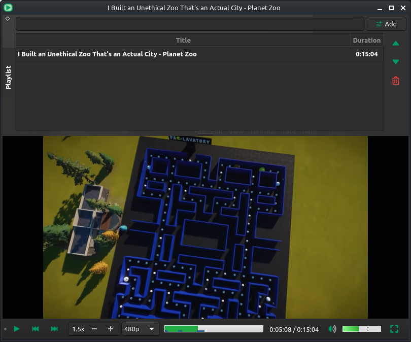

# Qt Player

Simple libmpv wrapper. Built to easily make a playlist with videos/podcasts from different providers and change playback speed.

Based on https://github.com/mpv-player/mpv-examples/tree/master/libmpv/qt_opengl


- Drag link or file to program window to add to playlist.
- Playlist is visible when windowed, hidden on Fullscreen.
- Control bar is always visible.
- Changing video resolution restarts the video and only works for Youtube videos.
- `Space` to toggle Play/Pause.
- `Esc` exit fullscreen.
- `Double click` on video to toggle Fullscreen.
- `Click` on video to toggle Play/Pause.


### Screenshot:


### Dependencies:
- `mpv` (with `youtube-dl` for online media)
- `qt5`

### Install:
```
git clone https://github.com/slidinghotdog/qtplayer.git
cd qtplayer
mkdir -p build && cd build
cmake .. && make && sudo make install
```