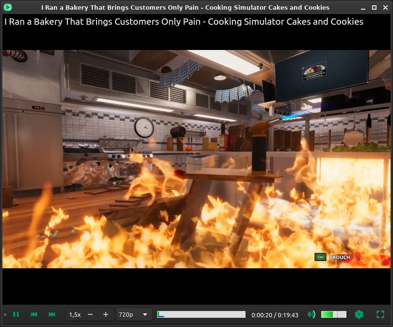

# Qt Player

Simple libmpv wrapper. Built to easily make a playlist with videos/podcasts from different providers and change playback speed.

Based on https://github.com/mpv-player/mpv-examples/tree/master/libmpv/qt_opengl


- Drag link or file to program window to add to playlist.
- Overlay on video with media title.
- Playlist and Controls bar can be set to fixed or auto hide.
- Changing video resolution restarts the video and only works if supported by `youtube-dl`.
- `Space` to toggle Play/Pause.
- `Esc` to exit Fullscreen.
- `Double click` on video to toggle Fullscreen.
- `Click` on video to toggle Play/Pause.
- `Mouse Wheel` Actions on Seekbar, Volumebar and Video frame (configurable);


### Screenshot:


### Dependencies:


#### Ubuntu (20.04+)
`sudo apt install git cmake g++ pkg-config qtbase5-dev libqt5widgets5`

`sudo apt install --no-install-recommends libmpv-dev`
(this is to avoid pulling `youtube-dl`, install it separately)

`youtube-dl` if usually outdated on repos and stops working when there are API changes on websites, check [official installation instructions](https://github.com/ytdl-org/youtube-dl#installation) or install `snap` version.

#### Arch
`sudo pacman -S --needed git base-devel cmake pkgconf qt5-base qt5-svg mpv youtube-dl`

### Install:
```
git clone https://github.com/elviosak/qtplayer.git
cd qtplayer
mkdir -p build && cd build
cmake .. && make && sudo make install
```
